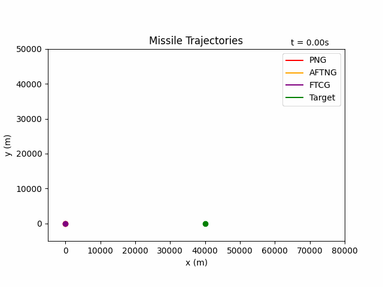

As a semester project, I implemented [this paper](https://arc.aiaa.org/doi/abs/10.2514/1.G007664), which derives and evaluates the performance of three guidance laws for a pursuer tracking an accelerating target. The guidance laws are:

- ProNav (PNG)
- Finite time convergence guidance (FTCG)
- Adaptive finite time nonlinear guidance (AFTNG)

My implementation of the three guidance laws can be found [here](https://github.com/lshums16/adaptive-pursuer-guidance-law). This project involved skills in:
- Nonlinear control
- Adaptive control
- Lyapunov stability analysis
- Python

As shown in the GIF above, all three guidance laws successfully hit the target, but they do so at different times. Further analysis showed that more extreme acceleration profiles of the target resulted in higher success for FTCG and AFTNG in comparison with PNG. 

