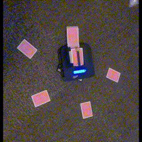
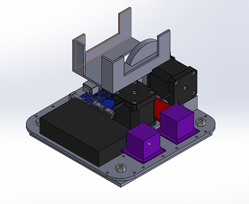
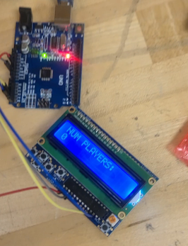
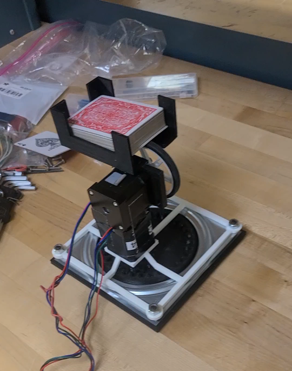

As a semester project, I designed a table-top robot that can deal out playing cards according to the number of players and cards per player (as input by the user). This project involved:
- Mechanical design (CAD)
- Circuit design
- Programming in C (Arduino)
- 3D printing

Extensive CAD design was required to mount and connect both electrical and mechanical components. The robot consisted of an Arduino Uno, stepper motors, an LCD screen, and a QRD sensor. Structural components were 3D printed.

The design process involved frequent prototyping and design testing.

<!--more-->
