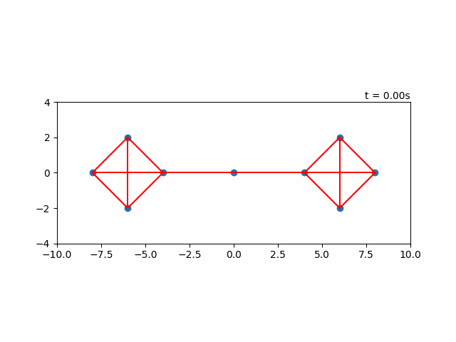
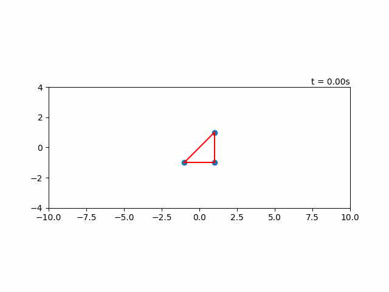

As a class project, I implemented [this paper](https://ieeexplore.ieee.org/document/4285848), which develops control laws for multi-agent rendezvous and formation control that guarantee the preservation of distance-based connectedness (i.e. communications radius). This project involved skills in:

- Cooperative control
- Consensus in multi-agent systems
- Multi-agent rendezvous and formation control
- Programming in Python

My implementation of these methods can be found [here](https://github.com/lshums16/Connectedness-with-Rendezvous-and-Formation-Control).

#### Naive Rendezvous

This example demonstrates a basic rendezvous algorithm that doesn't preserve connectedness, resulting in undesireable behavior.

#### Rendezvous with Guaranteed Connectedness:

This example demonstrates the rendezvous algorithm from the paper that guarantees connectedness throughout the maneuver.

#### Formation Control

This example displays a very basic formation control example. More complicated examples are left to future work.

