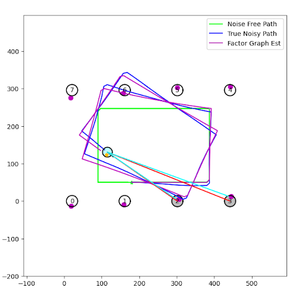
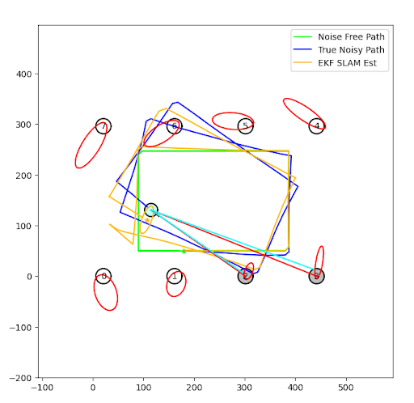

As a semester project, another student and I implemented [this paper](https://journals.sagepub.com/doi/abs/10.1177/0278364906072768?casa_token=pN7fAOwwlNkAAAAA:xKHvBlwOmA85TjnqGrDAXJuP4rMFblq04_ujgPm3OZN5w3V_GW1w1iO37ldpOapQezLfnxLLRWhfzTk), which develops an offline, factor graph-based SLAM algorithm called Square Root SAM. This method estimates both the state of a mobile robot over time and the locations of stationary landmarks based on noisy sensor data and imperfect motion commands.

My implementation of this project is kept private on Github. This project involved skills in:

- State estimation
- SLAM
- Data Association
- Dynamics Systems
- Python

The following figures show the performance of Square Root SAM (top) over an EKF-based SLAM method (bottom). Both algorithms were run offline on the same data set. 

